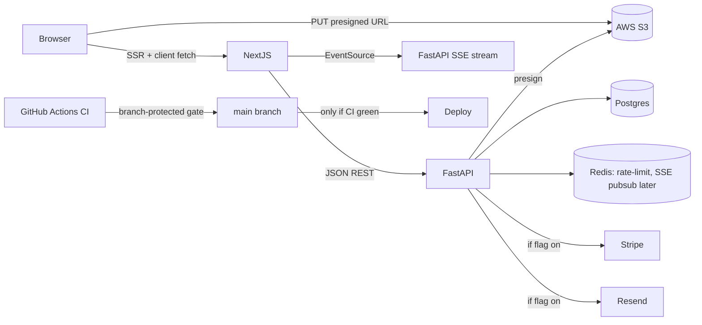

# Production-ready property platform

## Guiding principles

- **Every PR is mergeable on its own.** Nothing is left half-wired.
- **Feature flags over deletes.** Stripe/Resend/Google OAuth stay behind `*_MOCK_MODE` env flags so the app runs without their keys, and flips to real calls the moment a key is dropped in.
- **No silent failures.** If an integration is missing, the UI either hides the affected control or shows a clean empty state — never a broken screenshot.
- **Tests block the PR.** `main` gets branch protection; `deploy.yml` becomes `needs: [ci]`.
- **Workflow from your image is enforced literally:** each phase explores first (readonly), writes a plan doc in the PR description, codes, runs the full local + CI test matrix, and only then opens the PR.

## Target architecture (what changes vs today)

## Inventory of what's actually broken today

Confirmed via codebase read (all findings cite live files):

- **Availability page is static** — [`frontend/app/(public)/availability/AvailabilityClient.tsx`](frontend/app/(public)/availability/AvailabilityClient.tsx) lines 33–44 hardcode `MOCK_PROPERTIES`; never calls `GET /api/properties`.
- **Featured home section is static** — [`frontend/components/home/FeaturedProperties.tsx`](frontend/components/home/FeaturedProperties.tsx) lines 22–88 hardcode listings despite self-comment "replaced by API data in production".
- **Property detail page is static** — [`frontend/app/(public)/availability/[id]/page.tsx`](frontend/app/(public)/availability/[id]/page.tsx) uses `MOCK_PROPERTIES.find`.
- **Owner dashboard is ~80% hardcoded** — [`frontend/app/(dashboard)/owners/dashboard/page.tsx`](frontend/app/(dashboard)/owners/dashboard/page.tsx): Properties tab (84–107), Applications (113–117), Financials (180–192), Maintenance (206–218), Settings hardcodes `Jagannath Sai` + card `4242`. Only `/api/owners/me` + `/api/owners/portfolio` are wired (330–349).
- **Tenant dashboard is ~90% hardcoded** — [`frontend/app/(dashboard)/tenants/dashboard/page.tsx`](frontend/app/(dashboard)/tenants/dashboard/page.tsx): sidebar badge (17), KPIs (30–34), payments (114–131), maintenance submit is local-state only (160), documents (220–224), messages (248–251). Only `/api/tenants/me` is wired.
- **S3 upload works on the backend but no UI uses it.** [`backend/app/services/storage_service.py`](backend/app/services/storage_service.py) + [`backend/app/routers/properties.py`](backend/app/routers/properties.py) lines 321–352 are ready. No owner "post a listing with images" screen exists anywhere.
- **Stripe is fully mocked** — [`backend/app/routers/_combined.py`](backend/app/routers/_combined.py) lines 157–191 create `pi_mock_*` intents; webhook is a no-op.
- **Marketing trust content is fabricated** — [`frontend/components/home/TestimonialsCarousel.tsx`](frontend/components/home/TestimonialsCarousel.tsx) invented people, [`frontend/components/home/StatsBar.tsx`](frontend/components/home/StatsBar.tsx) invented stats, `+1-555-123-4567` JSON-LD in [`frontend/app/(public)/page.tsx`](frontend/app/(public)/page.tsx). You confirmed you will supply real copy.
- **Auth/scoping gaps** — [`backend/app/routers/applications.py`](backend/app/routers/applications.py) line 167 does not enforce owner-of-property on `GET /{id}`; 191–196 skips ownership check when `property_id` is NULL; [`backend/app/routers/_combined.py`](backend/app/routers/_combined.py) lines 82–92 and 145–154 return ALL rows to non-tenant roles; 93–117 lets any owner PATCH any maintenance request.
- **Frontend middleware is cosmetic** — [`frontend/middleware.ts`](frontend/middleware.ts) only checks cookie presence; no JWT verify, no role check. Login writes `access_token` to `localStorage` + a non-HttpOnly cookie (XSS risk).
- **CI lies about cross-browser** — [`.github/workflows/ci.yml`](.github/workflows/ci.yml) installs Chromium only but [`frontend/playwright.config.ts`](frontend/playwright.config.ts) declares Firefox, WebKit, mobile Chrome, mobile Safari. `deploy.yml` has no `needs` on `ci.yml`.
- **Seed script ships a known weak password** — `backend/scripts/create_test_users.py` creates `test_*@example.com` with `password123`.

## Delivery phases (one PR each, each green before next starts)

### PR 1 — Live public catalog

- Replace `MOCK_PROPERTIES` everywhere with real `GET /api/properties` calls:
  - `AvailabilityClient.tsx` — server component fetch + filters sent as query params (backend already supports `status`, `city`, `property_type`, `min_rent`, `max_rent`, `bedrooms` per [`backend/app/routers/properties.py`](backend/app/routers/properties.py) lines 104–186).
  - `FeaturedProperties.tsx` — `?is_featured=true&limit=6`.
  - `availability/[id]/page.tsx` — `GET /api/properties/{id}`.
- Add a graceful empty state ("No properties available yet") with a CTA to owner signup so a cold database doesn't look broken.
- Add bucket hostname to [`frontend/next.config.mjs`](frontend/next.config.mjs) `remotePatterns` (already covers `*.amazonaws.com` — confirm region).
- Playwright specs in `frontend/tests/e2e/availability.spec.ts` + `home.spec.ts` updated to assert data came from API (mock route with `page.route` for deterministic tests).

### PR 2 — Owner post-a-listing + S3 image pipeline

- New route `frontend/app/(dashboard)/owners/dashboard/properties/new/page.tsx`: title, address, city/state/zip, lat/lng (Mapbox geocoder), beds/baths/sqft, rent, deposit, amenities chips, pet policy, drag-drop image uploader.
- Client flow: `POST /api/properties` → for each file `POST /api/properties/{id}/images` to get presigned URL → browser `PUT` directly to S3 → poll GET property to confirm `images[]` contains the URL.
- Replace static 3 fake properties in owner dashboard `PropertiesTab` with `GET /api/owners/portfolio` data + edit/archive actions.
- New Playwright spec: owner logs in, posts a property with 2 images, verifies it appears on public `/availability`.
- **Needs from you**: S3 bucket name, AWS region, IAM access key id + secret. I will also give you the exact S3 CORS policy + IAM policy JSON to paste into the AWS console.

### PR 3 — Live owner dashboard

- `ApplicationsTab` — `GET /api/applications` + approve/reject via `PATCH /api/applications/{id}`.
- `FinancialsTab` — new backend endpoint `GET /api/owners/financials?range=ytd` returning aggregates; remove hardcoded `REVENUE_DATA`/`EXPENSE_DATA` arrays from page.tsx lines 23–32.
- `MaintenanceTab` — `GET /api/maintenance` (scoped fix landing in PR 5) + status updates.
- `SettingsTab` — real name from `/api/owners/me`, working 2FA enrollment, real payout method shape (empty state until Stripe Connect is added in PR 6).
- KPI "change" subtext (`+2 this year`, `+3.4% vs last mo`) computed from period-over-period queries, not hardcoded.

### PR 4 — Live tenant dashboard + SSE approval push

- Tenant `ApplicationTab` — `GET /api/applications` (tenant scope) and an EventSource subscription to a new endpoint `GET /api/applications/stream` (FastAPI `StreamingResponse` with `text/event-stream`, keep-alive ping every 15s, emits on status transitions of any application whose `tenant_id == current_user.id`).
- Transition emission: on `PATCH /api/applications/{id}` success, publish to an in-process `asyncio.Queue` fan-out keyed by `tenant_id`. Single-process now (no Redis); Redis pub/sub is a 30-line upgrade when we go multi-replica — noted in PR 7.
- Tenant `PaymentsTab` — `GET /api/payments` + "pay rent" button; calls Stripe flow from PR 6 (hidden if `STRIPE_MOCK_MODE=true`).
- Tenant maintenance submit wired to `POST /api/maintenance`; list via `GET /api/maintenance`.
- Sidebar badge counts real (unread messages + pending applications).
- Documents tab: minimal list using S3 presigned GETs off new `documents` table (small schema add, Alembic migration).

### PR 5 — Auth, RBAC, and scoping hardening

- [`backend/app/routers/applications.py`](backend/app/routers/applications.py):
  - `GET /{id}` — enforce `app.property_listing.owner_id == current_user.id` when role=owner.
  - `PATCH /{id}` — reject if `property_id` is NULL; require ownership.
- [`backend/app/routers/_combined.py`](backend/app/routers/_combined.py):
  - `GET /payments` owner branch filters to `Payment.property_id IN (owner's properties)`.
  - `GET /maintenance` owner branch same.
  - `PATCH /maintenance/{id}` — join to `Property.owner_id == current_user.id`.
- [`frontend/middleware.ts`](frontend/middleware.ts) validates JWT via a lightweight `/api/auth/whoami` call (cached 30s) and enforces role split (`tenant` user hitting `/owners/dashboard` → 403 page).
- Move `access_token` to **HttpOnly, Secure, SameSite=Lax** cookie; drop localStorage storage; add a tiny Next.js route handler proxy that forwards the cookie as `Authorization: Bearer` to FastAPI.
- Delete or guard `backend/scripts/create_test_users.py` with `if ENVIRONMENT == "development": ...` and randomized passwords.
- Default `ALLOWED_ORIGINS` away from `*`; derive from `NEXT_PUBLIC_APP_URL`.
- Add `pytest` coverage for every new scoping rule (test: owner A cannot read owner B's application, etc.).

### PR 6 — Stripe + Resend (feature-flagged real integrations)

- Stripe: replace `pi_mock_*` in [`backend/app/routers/_combined.py`](backend/app/routers/_combined.py) lines 157–184 with real `stripe.PaymentIntent.create`; webhook verifies signature with `STRIPE_WEBHOOK_SECRET`, handles `payment_intent.succeeded` / `.payment_failed`, updates `Payment.status`. Gated by `STRIPE_MOCK_MODE=false`.
- Resend: [`backend/app/services/email_service.py`](backend/app/services/email_service.py) — if `RESEND_API_KEY` set, actually send; else log JSON to structlog. All current callers (application submitted, maintenance created, payment receipt) route through this.
- New env flags documented in `.env.example` with defaults that mean "mock is on".

### PR 7 — CI matrix + branch protection + cross-browser gates

- [`.github/workflows/ci.yml`](.github/workflows/ci.yml):
  - `npx playwright install --with-deps chromium firefox webkit` (full matrix).
  - Add mobile Chrome + mobile Safari Playwright projects to the CI run.
  - Add Pylint job (`pylint app/ --fail-under=8.0`, matching Makefile).
  - Add Robot acceptance as a dedicated job.
  - Upload HTML reports for all three browsers as separate artifacts.
- [`.github/workflows/deploy.yml`](.github/workflows/deploy.yml): add `needs: [backend-tests, e2e-tests, frontend-build]` and `if: github.event.workflow_run.conclusion == 'success'` so deploy is truly gated.
- Add `.github/dependabot.yml` (weekly), CodeQL workflow, `pip-audit` + `npm audit --audit-level=high` jobs.
- Branch protection rules on `main` (I will give you the exact GitHub settings to toggle — this is a UI action you must do, I cannot flip it from code).

### PR 8 — Real marketing content swap-in

- You send me the real testimonials (names, roles, quotes, avatars), real numbers for StatsBar and the hero stats preview, and the real customer-support phone number.
- I replace the hardcoded copy in [`frontend/components/home/TestimonialsCarousel.tsx`](frontend/components/home/TestimonialsCarousel.tsx), [`frontend/components/home/StatsBar.tsx`](frontend/components/home/StatsBar.tsx), [`frontend/components/home/HeroSection.tsx`](frontend/components/home/HeroSection.tsx), [`frontend/app/(public)/page.tsx`](frontend/app/(public)/page.tsx) JSON-LD, and [`frontend/app/(public)/about/page.tsx`](frontend/app/(public)/about/page.tsx).
- Put the copy behind a typed config file `frontend/lib/site-content.ts` so future edits don't need a code review.

## What I need from you before each PR starts

- **Before PR 2 kickoff**: AWS bucket name, region, `AWS_ACCESS_KEY_ID`, `AWS_SECRET_ACCESS_KEY`. I will give you the CORS policy JSON (allowing `PUT` from your app origin) and the minimal IAM policy (S3:PutObject / GetObject / DeleteObject on that bucket only).
- **Before PR 6**: Stripe test-mode `sk_test_*`, `pk_test_*`, webhook `whsec_*`; Resend API key + verified sending domain. If you don't have these, PR 6 ships with flags off and everything works except you can't accept real payments yet.
- **Before PR 8**: real testimonials, real stats, real phone. Until then, PR 1–7 intentionally leave those components alone so no regressions ship.
- **Before production launch** (not blocking PRs): managed Postgres (Neon/Supabase/RDS), a deploy target decision (Lightsail continues / migrate to ECS or Fly), production domain, Google OAuth client if you want social login.

## MAANG-bar improvements I recommend beyond the letter of your ask

- **Observability**: Sentry (frontend + backend), OpenTelemetry traces from FastAPI → Postgres → S3. Small config change, huge win for debugging prod. Proposed in PR 7.
- **Data retention & GDPR**: right-to-delete endpoint + 30-day soft delete on users. Proposed as a small addition in PR 5.
- **Accessibility**: add `@axe-core/playwright` to E2E; assert zero WCAG A violations on every public page. Added in PR 7.
- **Performance budget**: Lighthouse CI on PRs with a p95 budget (LCP ≤ 2.5s, TBT ≤ 200ms). Added in PR 7.
- **PII encryption coverage audit**: SSN/Gov ID already encrypted via `FIELD_ENCRYPTION_KEY`; I'll extend to DOB and payout bank details in PR 5.
- **Rate limiting**: already via slowapi — I'll add per-user (not just per-IP) limits on application submit and payment intent endpoints in PR 5 to thwart credential-stuffing and probe attacks.

I will not write any code until you approve this plan.